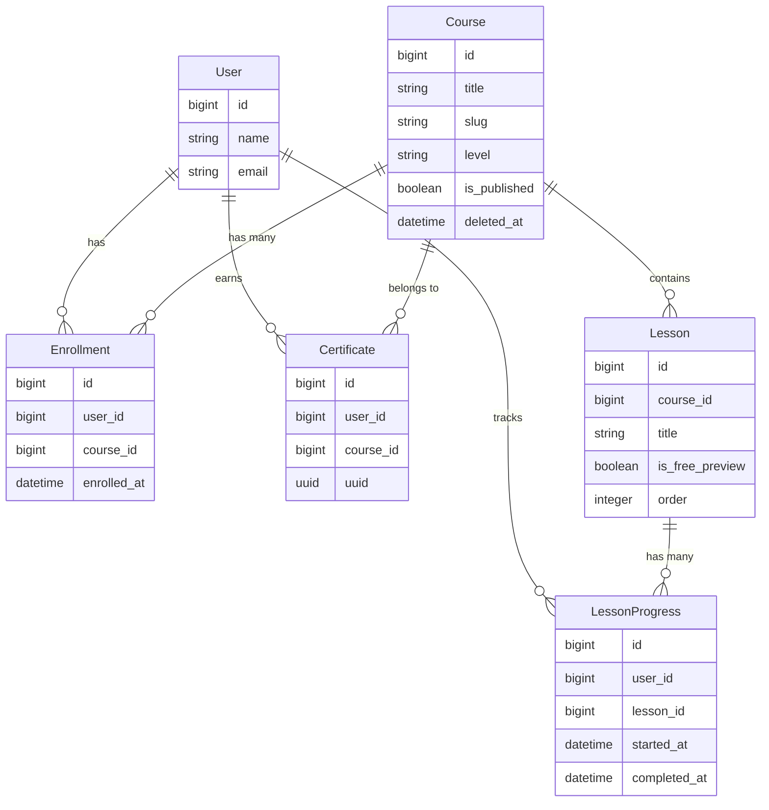

# LMS Architecture & Concurrency Strategy

## ERD Overview

## 🔄 Concurrency & Data Integrity

The system is architected to remain logically consistent under real-world stress (rapid clicks, retries, queue delays).

### 1. Enrollment Integrity
- **Database Level**: A hard unique constraint exists on `(user_id, course_id)` in the `enrollments` table.
- **Application Level**: `EnrollUserAction` wraps the check and creation in a database transaction with `lockForUpdate()`, providing a robust defense against race conditions.
- **Rules**: Users cannot enroll in draft courses. Guests are redirected to authentication.

### 2. Course Completion & Certification
- **Exactly-Once Rule**: Course completion results in exactly one certificate (UUID-based) and exactly one notification email.
- **Idempotency**: `GenerateCertificateAction` uses atomic `firstOrCreate` logic. The `IssueCertificate` listener ensures notifications are only dispatched when a *new* certificate is officially issued.
- **Course Changes**: If lessons are added or removed after enrollment, the completion logic dynamically re-evaluates the "required lessons" count on the next completion event.

### 3. Slug Uniqueness & Soft Deletes
- **Hard Constraint**: Slugs are unique at the database level.
- **Soft Delete Handling**: When a course is soft-deleted, its slug is retained. This prevents routing collisions and ensures that historical enrollment records remain logically tied to the original course identity.

## 🛠️ Performance & Scalability
- **No N+1 Queries**: Eager loading (`withCount`, `with`) is utilized in all major components.
- **Indexing**: Performance indexes exist on `published` status, `order` fields, and `progress` timestamps.
- **Queued Execution**: All side effects (emails, certificates) are processed asynchronously via the `worker` service.

## Action Classes
- `App\Actions\EnrollUser`: Handles the enrollment process.
- `App\Actions\CompleteLesson`: Handles marking a lesson as done and checks for course completion.
- `App\Actions\GenerateCertificate`: Handles UUID generation and issuing.
